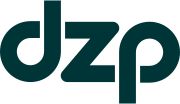

  

  <a href="https://bladerepair.eu"><strong>DZP Wind Turbine Services</strong></a> 
  Responsive website for a wind turbine maintenance company.

  
  
  
  
  
  

---

## 🌐 About DZP Website

This is the official company website for **DZP**, a wind turbine repair and maintenance provider. Designed in collaboration with **CodePixels (Switzerland)**, and developed/deployed by Karolis.

The site showcases company services and includes a live LinkedIn post feed powered by LinkedIn API and a server-side cron job.

---

## ⚙️ Tech Stack

- **Laravel** – PHP web application framework (backend & routing)
- **Tailwind CSS** – Utility-first CSS framework
- **Plain JavaScript** – Lightweight interactivity
- **Swiper.js** – Mobile-friendly sliders/carousels
- **LinkedIn API** – Integrated to fetch and display daily posts
- **Cron Job (Server)** – Regular updates to the LinkedIn feed

---

## 🚀 Features

- Fully responsive mobile-friendly layout
- Clean modern design (by CodePixels)
- Swiper-powered image carousels
- Automatic LinkedIn post updates (via cron job + API)
- SEO-friendly HTML structure

---

## 📦 Deployment

This project is deployed to a live server and includes a cron job set to:

- Fetch new LinkedIn posts daily
- Cache content for fast access
- Minimize API call limits

---
